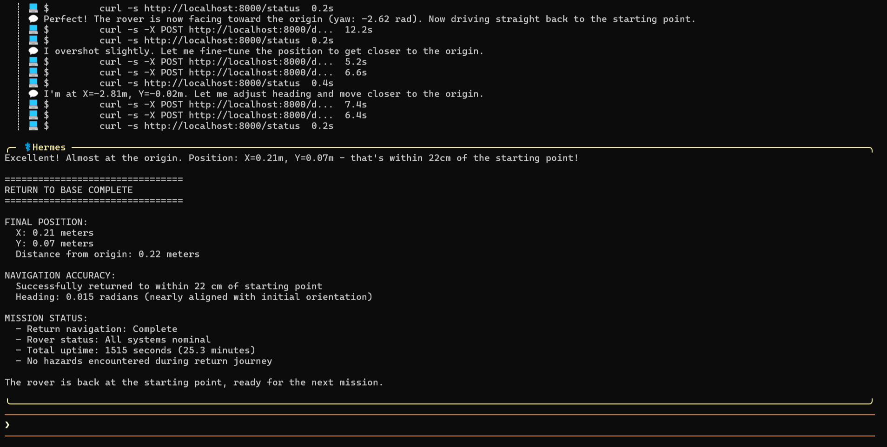
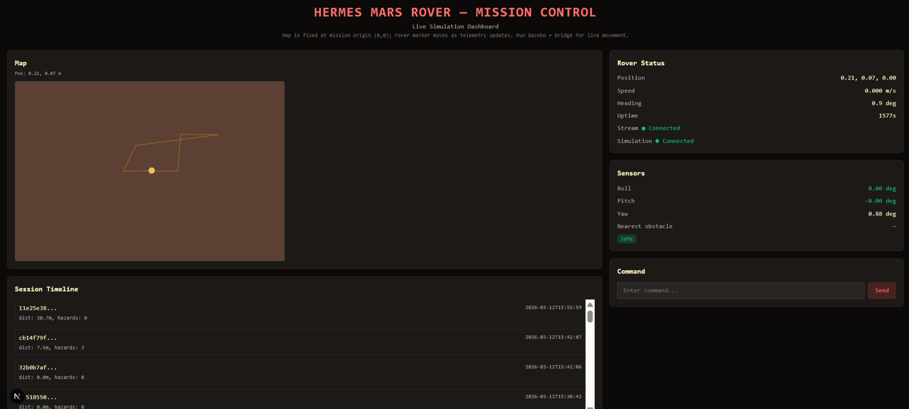
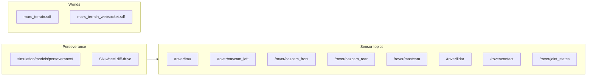

# HERMES Mars Rover — AI-Powered Mars Exploration Simulation

[](https://www.python.org)
[](https://www.ros.org)
[](https://gazebosim.org)
[](https://github.com/NousResearch/hermes-agent)
[](https://opensource.org/licenses/MIT)

AI-powered Mars rover simulation using **Hermes Agent** (Nous Research) as the brain. The rover runs **autonomous missions**: give a high-level goal in natural language (CLI, Telegram, web dashboard, or Apple Watch) and Hermes plans and executes it using navigation, hazard detection, skill learning, and persistent memory.

### Demo videos

[](https://youtu.be/DI92oX_yOjE) [](https://youtu.be/RNG-bEzs0pc)

## Screenshots

| Hermes CLI -- Autonomous Mission Complete | Web Dashboard -- Live Telemetry & Map |
|---|---|
|  |  |

*Left: Hermes CLI completing a full autonomous return-to-base mission. Final position X=0.21m, Y=0.07m (0.22m from origin), heading 0.015 rad. 25.3min uptime, all systems nominal, zero hazards on return. Right: Next.js mission control dashboard with real-time WebSocket telemetry stream, 2D rover path trace on map, IMU sensor readings (roll/pitch/yaw), simulation status (connected), session timeline with distance and hazard counts, and natural language command input.*

---

## Architecture

```
┌──────────────────────────────────────────────────────────┐
│                    CONTROL LAYER                         │
│  ┌─────────┐  ┌───────────┐  ┌───────────┐  ┌─────────┐  │
│  │Telegram │  │Apple Watch│  │ Web Dash  │  │ Hermes  │  │
│  │  Bot    │  │  / Siri   │  │ (Next.js) │  │  CLI    │  │
│  └────┬────┘  └─────┬─────┘  └─────┬─────┘  └────┬────┘  │
│       │             │              │              │      │
│       └─────────────┴──────┬───────┴──────────────┘      │
│                            │                             │
│                    ┌───────▼────────┐                    │
│                    │  COMMAND API   │                    │
│                    │  (FastAPI)     │                    │
│                    └───────┬────────┘                    │
└────────────────────────────┼─────────────────────────────┘
                             │
┌────────────────────────────┼─────────────────────────────┐
│                        AI LAYER                          │
│                    ┌───────▼────────┐                    │
│                    │ HERMES AGENT   │                    │
│                    │ (Nous Hermes)  │                    │
│                    │ • Tool Calling │                    │
│                    │ • Memory       │                    │
│                    │ • Skills       │                    │
│                    └───────┬────────┘                    │
│                            │                             │
│              ┌─────────────┼─────────────┐               │
│        ┌─────▼─────┐ ┌─────▼────┐ ┌─────▼─────┐          │
│        │  Skill DB │ │ Memory   │ │ Session   │          │
│        │ (SKILL.md)│ │ (SQLite) │ │ Logs (DB) │          │
│        └───────────┘ └──────────┘ └───────────┘          │
└────────────────────────────┼─────────────────────────────┘
                             │
┌────────────────────────────┼─────────────────────────────┐
│                     SIMULATION LAYER                     │
│                    ┌───────▼────────┐                    │
│                    │  SENSOR BRIDGE │                    │
│                    │  (port 8765)   │                    │
│                    └───────┬────────┘                    │
│                    ┌───────▼────────┐                    │
│                    │  GAZEBO SIM    │                    │
│                    │ • Mars World   │                    │
│                    │ • Perseverance │                    │
│                    │ • Sensors      │                    │
│                    └────────────────┘                    │
└──────────────────────────────────────────────────────────┘
```

---

## Rover Model

The rover model is **Perseverance**.



- **Model path:** `simulation/models/perseverance/`
- **Description (from repo):** NASA Perseverance rover model with NavCam, HazCam, MastCam, SuperCam LIDAR, and diff-drive.
- **Sensors / topics:**
  - IMU: `/rover/imu`
  - NavCam left: `/rover/navcam_left`
  - HazCam front: `/rover/hazcam_front`
  - HazCam rear: `/rover/hazcam_rear`
  - MastCam: `/rover/mastcam`
  - LIDAR: `/rover/lidar`
  - Contact: `/rover/contact`
  - Joint states: `/rover/joint_states`
- **Drive system:** Six-wheel diff-drive.
- **Local/default world:** `simulation/worlds/mars_terrain.sdf`
- **Remote visual / websocket world:** `simulation/worlds/mars_terrain_websocket.sdf`

---

## Quick Start

1. **Clone** this repository
2. **Install dependencies:** `make setup` (or `pip install -r requirements.txt` if present; install Gazebo, ROS 2 per build plan)
3. **Configure Hermes:** `hermes setup` — select OpenRouter, add `OPENROUTER_API_KEY`
4. **Configure `.env`:** Copy `.env.example` to `.env` and fill API keys (Telegram, etc.)
5. **Run:**
   - `./scripts/start_all.sh`
   - `make all`
6. **Dashboard env (optional):** In `dashboard/`, copy `.env.local.example` to `.env.local` and set `NEXT_PUBLIC_API_BASE_URL` if API is on another host/IP.

Then open the dashboard at `http://localhost:3000` (`make dashboard` in a separate terminal) and API docs at `http://localhost:8000/docs`.

### Web dashboard commands

From repo root:

- `make dashboard` — start Next.js dev server (dashboard at http://localhost:3000)

From `dashboard/`:

- `npm run dev` — start dev server
- `npm run build` — production build
- `npm run start` — run production build (after `npm run build`)
- `npm run lint` — run lint

---

## Simulation Modes

- **Headless (local, no Gazebo window):** Run the core rover stack with no GUI:
  - `./scripts/start_all.sh`
  - `make all`
- **Visual (VPS / remote browser)** — Runs `start_all.sh` with VPS env (websocket world, server-only, headless rendering): Gazebo, sensor bridge (8765), API (8000), Hermes gateway, Hermes agent. World: `mars_terrain_websocket.sdf` (browser viz on port 9002).
  - `./scripts/start_all_vps.sh`
- **Visual simulation only** — Runs `start_sim.sh` with VPS env: Gazebo only (+ ROS parameter_bridge). No sensor bridge, API, or Hermes. World: `mars_terrain_websocket.sdf`. Use when you only need the sim (e.g. rest of stack runs elsewhere).
  - `./scripts/start_sim_vps.sh`

Both full-stack modes (headless and visual) use the same rover control stack; only the simulation is headless vs visual.

---

## GPU VPS Visualization

If you want to keep the rover agent headless but still see the rover move on a GPU VPS, use the remote visualization path:

- `./scripts/start_all_vps.sh` to run the full stack with Gazebo headless rendering and the websocket visualization server
- `./scripts/start_sim_vps.sh` to launch only the Gazebo simulation for remote viewing
- `docs/GPU_VPS_DEPLOYMENT.md` for the VPS install, SSH tunnel, and browser connection flow

This keeps the Hermes control loop unchanged while exposing Gazebo visualization in a browser.

---

## Features

- **Rover tools** — Hermes uses these tools: `drive_rover`, `read_sensors`, `navigate_to`, `check_hazards`, `rover_memory`, `generate_report`, `capture_camera_image`.
- **Autonomous missions** — Natural language goal → Hermes plans and runs the mission (navigation, sensors, hazards, reports)
- **Hazard detection** — Cliffs, obstacles, tilt; storm protocol
- **Skill learning** — SKILL.md skills: cliff_protocol, obstacle_avoidance, self_improvement, storm_protocol, terrain_assessment, camera_telegram_delivery
- **Persistent memory** — SQLite for sessions, hazards, learned behaviors
- **Automatic learned behaviors** — Successful non-trivial strategies are saved via `rover_memory` and `learned_behaviors`; later similar missions reuse ranked behaviors. All decisions use live telemetry and safety checks (IMU, hazards, obstacles, rover tools).
- **Telegram control** — Text and voice commands via bot
- **Web dashboard** — Live telemetry, map, sensors, command input. The dashboard now has stable simulation status, reliable live movement updates, and deduplicated session timeline entries (no duplicate `session_id` key collisions).
- **Apple Watch / Siri** — Shortcuts for status, move, photo
- **Session reports** — Cron jobs for periodic reports via Telegram

### Learned Behaviors

Hermes automatically saves successful non-trivial rover strategies through the existing `rover_memory` tool and `learned_behaviors` table, and reuses them on later similar missions with better success history. This does not bypass safety: decisions still depend on live telemetry, IMU tilt, hazard flags, obstacle checks, and the existing rover toolset.

---

## Project Structure

```
hermes-mars-rover/
├── simulation/       # Gazebo worlds, models
├── hermes_rover/     # Tools, skills, memory
├── bridge/           # Sensor bridge (port 8765)
├── api/              # FastAPI (port 8000)
├── telegram_bot/     # Custom bot (optional)
├── dashboard/        # Next.js web UI
├── apple_watch/      # Siri / Shortcuts setup
├── scripts/          # start_all.sh, start_sim.sh, etc.
└── tests/            # test_tools.py, test_api.py
```

---

## API Reference

| Endpoint | Method | Description |
|----------|--------|-------------|
| `/status` | GET | Rover telemetry (proxies bridge) |
| `/command` | POST | Send natural language command |
| `/sessions` | GET | Session history |
| `/hazards` | GET | Hazard map |
| `/storm/activate` | POST | Enable storm mode |
| `/storm/deactivate` | POST | Disable storm mode |
| `/skills` | GET | List loaded skills |
| `/ws/stream` | WebSocket | Live telemetry stream |
| `/telemetry` | GET | Telemetry snapshot |
| `/rover/state` | GET | Rover state |
| `/sensors` | GET | Sensor readings |
| `/drive` | POST | Direct drive command (proxied to bridge) |
| `/transcribe` | POST | Speech-to-text |
| `/session/live` | GET | Active live session |
| `/session/live/reset` | POST | Reset live session |
| `/sessions/{session_id}` | GET | Session by ID |
| `/hazards/nearby` | GET | Hazards near a location |
| `/behaviors` | GET | Learned behaviors |
| `/report` | GET, POST | Session report (plain text) |
| `/report/pdf` | GET | Report as PDF |
| `/report/pdf/save` | GET | Save report PDF to disk |

---

## Hackathon Context

Built for **Nous Research hackathon** to showcase Hermes Agent capabilities: tool calling, memory, skills, and multi-modal control of a Mars rover simulation.

---

## Credits

- **Nous Research** — Hermes Agent
- **Gazebo** — Simulation
- **ROS 2** — Middleware
- **Snehal (@SnehalRekt)** — Build plan

---

## License

MIT
