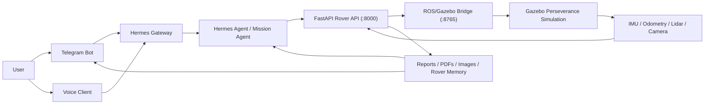

# HERMES Mars Rover – NASA Perseverance Simulation

AI‑powered Mars rover project built on **Hermes Agent**, **Gazebo**, **FastAPI**, **Telegram**, and a **Next.js** dashboard – now using the **real NASA Perseverance mesh/model** instead of primitive shapes.

The system lets you talk to the rover in natural language (CLI / Telegram / voice), run a headless physics simulation on a GPU VPS, and receive rich media (images, PDFs) back in Telegram.

---

## High‑Level Architecture

### Components

- `simulation/` – Gazebo worlds and the Perseverance rover model (SDF + meshes).
- `bridge/` – WebSocket bridge between Gazebo topics and the HTTP API (`:8765`).
- `api/` – FastAPI rover API for commands, telemetry, reports, and camera export (`:8000`).
- `hermes_rover/` – Hermes mission agent, tools (navigation, sensors, camera, memory).
- `hermes-agent/` – Upstream Hermes Agent framework and gateway integration.
- `telegram_bot/` – Telegram bot entrypoint (optional custom bot).
- `dashboard/` – Next.js mission dashboard (`:3000`) for telemetry and reports.
- `scripts/` – Startup / orchestration scripts (local + VPS).
- `docs/` – Deployment and operations docs (including GPU VPS guide).

### Data / Control Flow



Key points:

- Hermes Agent uses **tools** in `hermes_rover/tools/` to move the rover, read sensors, capture camera images, and query structured rover memory.
- When reports or images are generated, Hermes includes `MEDIA:/absolute/path/to/file` in its responses so the Hermes gateway/Telegram bot can send **real attachments**.
- The simulation uses the **real Perseverance model** from `simulation/models/perseverance/` with the DAE mesh in `resources/`.

---

## Prerequisites

You can run this in **Ubuntu** or **WSL2**. Recommended:

- Python **3.10+** (3.11 recommended)
- Node.js **18+**
- Gazebo Harmonic / Fortress (or Jetty, depending on distro)
- ROS 2 Humble / Jazzy (for bridge-based setups)
- A Telegram account and bot token from BotFather
- (Optional) GPU VPS with NVIDIA drivers + container runtime for remote rendering

---

## Environment Configuration

1. Copy the example env:

```bash
cp .env.example .env
```

2. Edit `.env` and fill in:

- **LLM / reasoning**: `OPENROUTER_API_KEY`, `OPENAI_API_KEY`, `OPENAI_BASE_URL`, `HERMES_REASONING_EFFORT`.
- **Voice tools**: `VOICE_TOOLS_OPENAI_KEY` (or rely on `OPENAI_API_KEY`).
- **Telegram**: `TELEGRAM_BOT_TOKEN`, `TELEGRAM_ALLOWED_USERS`, `TELEGRAM_HOME_CHANNEL`.
- **API / bridge**: `API_URL`, `BRIDGE_URL`, `ROVER_API_KEY`.
- **Supabase / dashboard**: `SUPABASE_URL`, `SUPABASE_KEY` (optional).
- **External tools**: `FIRECRAWL_API_KEY`, `FAL_KEY`, `ELEVENLABS_API_KEY` (optional).
- **Simulation / ROS**: `GZ_SIM_RESOURCE_PATH`, `ROS_DOMAIN_ID`, `HERMES_SIM_WORLD`, `HERMES_SIM_HEADLESS_RENDERING`, `HERMES_SIM_REALTIME`, `HERMES_SIM_VERBOSITY`.
- **Tunnel**: `TUNNEL_DOMAIN` for remote/Apple‑Watch access.

Never commit your `.env` file or real secrets.

---

## Installation

From the repo root:

```bash
git clone https://github.com/Snehal707/Hermes-mars-rover-NASA-Perseverance-.git
cd Hermes-mars-rover-NASA-Perseverance-

python3 -m venv .venv
source .venv/bin/activate    # On Windows/WSL: source .venv/bin/activate
pip install -r requirements.txt
```

Install dashboard dependencies:

```bash
cd dashboard
npm install
cd ..
```

---

## Running Locally (Full Stack)

1. **Start Gazebo simulation** (GUI on your machine):

```bash
bash scripts/start_sim.sh
```

2. **Start the bridge** (exposes sensors/cmd_vel via WebSocket/HTTP):

```bash
bash scripts/start_bridge.sh
```

3. **Start the FastAPI rover API**:

```bash
bash scripts/start_api.sh
```

4. **Start Hermes + gateway**:

```bash
bash scripts/start_gateway_pdf.sh   # Hermes Gateway (Telegram)
bash scripts/start_hermes.sh        # Hermes CLI / mission agent
```

5. **Start the dashboard**:

```bash
cd dashboard
npm run dev
```

Alternatively, you can use a single orchestrator:

```bash
bash scripts/start_all.sh
```

---

## Headless Sim & GPU VPS Deployment

For running on a remote GPU VPS (no local GUI):

- Use a Gazebo world like `simulation/worlds/mars_terrain_websocket.sdf` configured for headless rendering.
- Set in `.env`:
  - `HERMES_SIM_SERVER_ONLY=true`
  - `HERMES_SIM_HEADLESS_RENDERING=true`
  - `HERMES_SIM_REALTIME=true`
- Use the VPS scripts (see `docs/GPU_VPS_DEPLOYMENT.md`):
  - `scripts/start_sim_vps.sh` – start headless simulation/bridge.
  - `scripts/start_all_vps.sh` – start sim, API, Hermes, and gateway together.

These scripts are designed to be run via SSH on your VPS. You can then control the rover from your laptop or phone using the Hermes CLI and Telegram.

---

## Hermes CLI Usage

From the repo (with `.venv` active and services running):

```bash
bash scripts/start_hermes.sh
```

Example prompts:

- “Drive 5 meters forward, then stop and send me a status report.”
- “Explore the nearest crater rim, avoid hazards, and summarize what you found.”
- “Take a photo of the terrain ahead and send it to Telegram.”
- “Run a full mission and then send me the detailed research report in PDF.”

Hermes will call tools in `hermes_rover/tools/` (navigation, sensors, camera, memory) and may send media via `MEDIA:/absolute/path` tags that the gateway turns into real Telegram attachments.

---

## Telegram Control

1. Create a bot with BotFather and set `TELEGRAM_BOT_TOKEN` in `.env`.
2. Find your Telegram numeric user ID and set `TELEGRAM_ALLOWED_USERS`.
3. Run the gateway / Telegram bot:

```bash
bash scripts/start_gateway_pdf.sh
```

Then talk to your bot, for example:

- “Where is the rover right now?”
- “Navigate to (3.0, -2.0) safely.”
- “Send me the mission report in PDF.”
- “Capture an image from the front camera and send it.”

When a PDF or image is generated, Hermes includes `MEDIA:/absolute/path/to/file` in the message; the gateway uses this to send a **real file attachment** instead of plain text.

---

## Voice Commands

You can connect a voice client that:

- Listens on your microphone.
- Streams/transcribes speech via an OpenAI‑compatible API (`OPENAI_API_KEY` / `VOICE_TOOLS_OPENAI_KEY`).
- Sends text commands into Hermes (CLI or gateway).

Configure:

- `VOICE_TOOLS_OPENAI_KEY` (or reuse `OPENAI_API_KEY`).
- Any client‑side config referenced in your voice tooling.

Then you can say:

- “Hermes, explore the canyon and report hazards.”
- “Hermes, park the rover near the lander and send a photo.”

---

## Camera Image Capture

The rover’s **camera tools**:

- Capture images from the simulated Perseverance camera.
- Save files to a document/media cache directory.
- Return JSON with an **absolute file path**.

Hermes is instructed (via `hermes_rover/config/system_prompt.md` and `context.md`) to:

- Include `MEDIA:/absolute/path/to/image.png` in replies when camera capture succeeds.
- Use Telegram / gateway to send the actual image to you.

---

## Core API Endpoints

Some key FastAPI endpoints (see `api/main.py` for full list):

- `GET /status` – health and basic rover status.
- `GET /telemetry` – current metrics/telemetry.
- `POST /command` – high‑level command entrypoint.
- `POST /drive` – low‑level drive command.
- `GET /sessions` – rover mission sessions.
- `GET /report` – text mission report.
- `GET /report/pdf` – on‑demand PDF report.
- `GET /report/pdf/save` – generate + persist PDF report and return file path.
- `WS /ws/stream` – live telemetry and events.

Interactive docs: `http://localhost:8000/docs`

---

## Testing

Run tests from the repo root:

```bash
python3 -m pytest tests/ -q
```

Tests cover core rover tools (navigation, sensors, memory) and will be extended to include camera and regression checks for API behavior.

---

## Security Notes

- **Never** commit your `.env` or real tokens.
- Use `ROVER_API_KEY` to gate write operations in production‑like deployments.
- Restrict Telegram access with `TELEGRAM_ALLOWED_USERS` and keep the bot token secret.

---

## License

MIT – see `LICENSE`.

